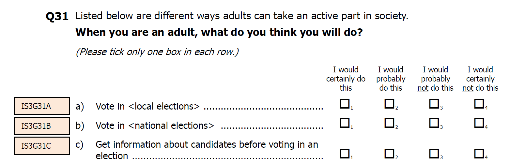

```{r setup_theme, include = FALSE}

library(xaringanthemer)
style_duo(
  primary_color = "white",
  secondary_color = "#1068E9",
  text_color = "#1068E9",
#  base_color = '#1068E9',
#  background_color = 'white',
  background_position = 'center',
  header_font_google = google_font("Lato"),
  text_font_google   = google_font("Lato", "300", "300i"),
  code_font_google   = google_font("Droid Mono"),
  code_font_size = '50%',
  padding = "0.4em 2.4em 0.4em 2.4em",
  extra_fonts = list(google_font("Lato")),
  extra_css = 
  list(
  ".red"   = list(color = "red"),
  ".small" = list("font-size" = "90%"),
  ".pull_l_70" = list("float" = "left","width" = "72%", "font-size" = "90%"),
  ".pull_r_30" = list("float" = "right","width" = "23%"),
  ".pull_left"  = list("float" = "left","width" = "47%", "height" = "100%", "padding-right" = "2%"),
  ".pull_right" = list("float" = "right","width" = "47%", "height" = "100%", "padding-left" = "2%"),
  ".small_left"  = list("float" = "left", "width" = "47%", "height" = "50%", "padding-right" = "2%"),
  ".small_right" = list("float" = "right","width" = "47%", "height" = "50%", "padding-left"  = "2%"),
  ".left_code" = list("float" = "left",  "width" = "47%", "height" = "100%", "padding-right" = "2%",
    "font" = "Hack"),
  ".code_out"  = list("float" = "right", "width" = "47%", "height" = "100%", "padding-left"  = "2%",
    "font" = "Hack"),
  ".text_180" = list("font-size" = "180%"),
  ".text_170" = list("font-size" = "170%"),
  ".text_160" = list("font-size" = "160%"),    
  ".text_150" = list("font-size" = "150%"),
  ".text_140" = list("font-size" = "140%"),  
  ".text_130" = list("font-size" = "130%"),
  ".text_120" = list("font-size" = "120%"),
  ".text_110" = list("font-size" = "110%"),
  ".text_110" = list("font-size" = "110%"),
  ".text_100" = list("font-size" = "100%"),
  ".text_90" = list("font-size" = "90%"),
  ".text_80" = list("font-size" = "80%"),
  ".text_70" = list("font-size" = "70%"),
  ".text_60" = list("font-size" = "60%"),
  ".text_50" = list("font-size" = "50%"),
  ".text_40" = list("font-size" = "40%"),
  ".text_30" = list("font-size" = "30%"),
  ".text_20" = list("font-size" = "20%"),
  ".line_space_11" = list("line-height" = "1.1em;"),
  ".line_space_09" = list("line-height" = "0.9em;"),
  ".line_space_07" = list("line-height" = "0.7em;"),
  ".line_space_05" = list("line-height" = "0.5em;"),
    ".tiny_text" = list(
      "font-family" = "Lato", 
      "font-size"= "70%"
      ),
    ".large_text" = list(
      "font-family" = "Lato", 
      "font-size"= "150%"
      ),
    ".slide_blue" = list(
      "background-color" = "#1068E9",
      "color" = "white"
      ),
  ".center_image" = list(
    margin  = "0",
    position = "absolute",
    top      = "50%",
    left     = "50%",
    '-ms-transform' = "translate(-50%, -50%)",
    transform = "translate(-50%, -50%)"
    )
  )
)


knitr::opts_chunk$set(comment = NA)
knitr::opts_chunk$set(dpi=1500)
# xaringanthemer::mono_light(background_position = 'center')

# preview slides
# xaringan::inf_mr('invalsi_workshop_template.rmd')


# padding-top: 0.4em;
# padding-right: 2.4em;
# padding-bottom: 0.4em;
# padding-left: 2.4em;

```


class: title-slide, middle, center

background-image: url(img/invalsi_left_blue.png), url(img/invalsi_right_blue.png)
background-position: top left, top right
background-size: 10%, 10%

```{r echo=FALSE, out.width = '2%', out.height = '2%'}
knitr::include_graphics('./img/blank_space.png')
```

<br>

.line_space_07[
## Advanced Secondary Analysis of Large-scale
## Assessments in Education:
### .text_70[A Discussion of Methods]
]
<br>

.line_space_05[
.text_100[Sandoval-Hernández, A., PhD.] .text_70[University of Bath]

.text_100[Carrasco, D., PhD.] .text_70[Centro de Medición MIDE UC]

.text_100[Miranda, D., PhD.] .text_70[Centro de Medición MIDE UC]

.text_100[Inostroza, P., Msc(c).] .text_70[KU Leuven]

<br>

.text_70[V Seminar: “INVALSI data: a tool for teaching and scientific research”]

.text_70[ROME,  February 25th – 28th, 2021]

]

<br>

```{r echo=FALSE, out.width = '10%'}
knitr::include_graphics('./img/bath_logo.svg')
knitr::include_graphics('./img/blank_space.png')
knitr::include_graphics('./img/mide_logo_2019.png')
knitr::include_graphics('./img/blank_space.png')
knitr::include_graphics('./img/ku_leuven_logo.svg')
```


---
class: center, middle, inverse

## Outline

Brief theoretical foundations

--

CFA Estimation: example

--

SEM estimation: example


---
class: center, middle, inverse

# Brief theoretical foundations

---
## Measurement in social sciences

- A hughe number of constructs, concepts, and attributes are considered as latent 

- The less measurement error, the better instrument

```{r echo=FALSE, out.width = '40%', fig.retina = 1, fig.align='center'}
# this is a slide displaying an image only
knitr::include_graphics('./files/factor.png')
```

---
## Total error: sources of error

```{r echo=FALSE, out.width = '60%', fig.retina = 1, fig.align='center'}
# this is a slide displaying an image only
knitr::include_graphics('./files/errortotal.png')
```


---
## Latent variables

- Indirectly observed: hipothetical

- Could be infered from observed indicators (e.g. items)

- Multiple indicators that covariates, could be intepreted as common factor 

---
## Latent variables

- Clasical Test Theory (simplified):

$$X = T + E $$
$$ \sigma^{2}_x = \sigma^{2}_t +  \sigma^{2}_e$$

- Existence of multiple indicators allows to differentiate:

common variance $$\sigma^{2}_t$$ and unique variance $$\sigma^{2}_e$$

---
## Factor Analysis

- Set of methods oriented to explain the correlation among variables which could be interpreted as latent variables or factors

- The existence of a common factor explain the association among indicators

- Conditional dependency: the correlations would be 0 if partialize the factor. 


---
## Purpose

- To reduce complexity and increse comprehension

- To validate scales in terms of the measured construct

- To separate the common variance from unique variance 


---
## General fuoundations

- Covariance, correlation and partial correlation

- Simple and multiple regression

- In general, could consider similar assumptions than in linear regression

---
## Assumptions 

- Intervalar measurment level

- Normality

- Linear relationship among variables

- Correlations must have certain level for its agrupation

- Sample size: >200 cases or between 5-10 for each variable (rule of thumb)

---
## Diagrams for representation

```{r echo=FALSE, out.width = '60%', fig.retina = 1, fig.align='center'}
# this is a slide displaying an image only
knitr::include_graphics('./files/diagrams.png')
```

---
## ¿Parsimony?

```{r echo=FALSE, out.width = '60%', fig.retina = 1, fig.align='center'}
# this is a slide displaying an image only
knitr::include_graphics('./files/growth2.png')
```

---
## Three methods for measurement evaluations

- Principal component analyses: definition of component from a linear combination of variables

- Exploratory factor analyses: descriptive thecnique which allow to determine a number of latent factors from a set of indicators, separating common and unique variance

- **Confirmatory Factor Analyses**: techinque which allow hipothetize (and confirm) a latent variable, specifing a set of parameters

---
## Three methods for measurement evaluations

```{r echo=FALSE, out.width = '100%', fig.retina = 1, fig.align='center'}
# this is a slide displaying an image only
knitr::include_graphics('./files/pcaefacfa.jpg')
```

---
## Beyond measurement model: SEM

- SEM allow to estimate models that include measurement and structural relations

```{r echo=FALSE, out.width = '60%', fig.retina = 1, fig.align='center'}
# this is a slide displaying an image only
knitr::include_graphics('./files/models1.png')
```

---
## Structural regressions between latent variables

```{r echo=FALSE, out.width = '70%', fig.retina = 1, fig.align='center'}
# this is a slide displaying an image only
knitr::include_graphics('./files/fullwang.jpg')
```

---
## Regressions between latent on observed variables (MIMIC)

```{r echo=FALSE, out.width = '40%', fig.retina = 1, fig.align='center'}
# this is a slide displaying an image only
knitr::include_graphics('./files/mimic.jpg')
```

---
## Regressions between observed on latent variables

```{r echo=FALSE, out.width = '60%', fig.retina = 1, fig.align='center'}
# this is a slide displaying an image only
knitr::include_graphics('./files/med_sem.jpg')
```

---
## Regressions between observed variables

```{r echo=FALSE, out.width = '60%', fig.retina = 1, fig.align='center'}
# this is a slide displaying an image only
knitr::include_graphics('./files/jose_33.jpg')
```

---
## Estimation process of CFA and SEM

```{r echo=FALSE, out.width = '50%', fig.retina = 1, fig.align='center'}
# this is a slide displaying an image only
knitr::include_graphics('./files/kline.png')
```


---
## Step by step

- Specification and identification
- Estimation
- Fit interpretation
- Report


```{r echo=FALSE, out.width = '40%', fig.retina = 1, fig.align='center'}
# this is a slide displaying an image only
knitr::include_graphics('./files/kline.png')
```

---
# Hands on!

.center[]


---
class: center, middle, inverse

# CFA example


```{r echo=FALSE, out.width = '60%', fig.retina = 1, fig.align='center'}
# this is a slide displaying an image only
knitr::include_graphics('./files/plotmodel1.png')
```

---
## Measurement model: Political participation using ICCS 2016 (Italy)

- Fornal participation
```{r echo=FALSE, out.width = '60%', fig.retina = 1, fig.align='center'}
# this is a slide displaying an image only

```

---
## Measurement model: Political participation using ICCS 2016 (Italy)

- Activist participation (legal and Illegal)
```{r echo=FALSE, out.width = '50%', fig.retina = 1, fig.align='center'}
# this is a slide displaying an image only

```


---
## Read data
```{r }
pacman::p_load(dplyr, stargazer, skimr, xaringan, srvyr, lme4, broom, texreg, scales, plotly, desctable, descriptr, forcats, GGally, MplusAutomation, semPlot, corrplot)


load("./data/mergeita16.Rdata")
names(mergeita16)

desc= mergeita16 %>%
  select(actspray, actblock, actocup, acttalk, actrep, actmarch, actsign, votopre, votomun, votoinf)
stargazer(desc,title="Descriptive Statistics", type = "text")

```


---
## Explore correlations
```{r }

corMat  <- cor(desc, use = "pairwise.complete.obs")  # estimar matriz pearson
options(digits=3) # decimales
print(corMat)

```

---
## Explore correlations
```{r }
stargazer(corMat, title="correlaciones", type = "text") #Latex table

```

---
## Explore correlations
```{r , fig.align='center', out.width = '70%', eval=FALSE}

corrplot(corMat, type="lower",
         order="AOE", cl.pos="b", tl.pos="d") #agrega nombres en diag.

```

```{r echo=FALSE, out.width = '40%', fig.retina = 1, fig.align='center'}
# this is a slide displaying an image only
knitr::include_graphics('./files/corr.png')
```


---
## Model specification

- Mplus Syntax

```{r , eval=FALSE }

m4 <- mplusObject(
  TITLE = "CFA;",
  VARIABLE=" 
  cluster = idschool_scr;
  Stratification = jkzones;
  Weight = totwgts;",
  ANALYSIS=
    "type = complex;",
  
  MODEL = "
   turnout BY votopre votomun votoinf;
   leg BY acttalk actrep actmarch actsign;
   ill BY actspray actblock actocup;
  "
  ,
  OUTPUT = "CINTERVAL sampstat mod stdyx;",
  rdata = mergeita16)

```


- Generate input and output files

```{r , eval=FALSE }

fit4 <- mplusModeler(m4, modelout = "m4.inp", run = 1L)

```

---
## Model specification

- Mplus Syntax

```{r , eval=FALSE }

TITLE: CFA;
DATA:
FILE = "m4_aa695dd1a4ce4e5cf60735b5179bb330.dat";
 
VARIABLE:
NAMES = idschool_scr totwgts jkzones actspray actblock actocup acttalk actrep
     actmarch actsign votopre votomun votoinf; 
 MISSING=.;
  
  cluster = idschool_scr;
  Stratification = jkzones;
  Weight = totwgts;
     
ANALYSIS:
type = complex;
     
MODEL:

   turnout BY votopre votomun votoinf;
   leg BY acttalk actrep actmarch actsign;
   ill BY actspray actblock actocup;
  
OUTPUT:
CINTERVAL sampstat mod stdyx;
```


---
## Model specification
```{r , fig.align='center', out.width = '70%', fig.dim=c(4.8, 4.5), eval=FALSE}

semPaths("./m4.out", intercepts = FALSE, rotation=2)

```

```{r echo=FALSE, out.width = '60%', fig.retina = 1, fig.align='center'}
# this is a slide displaying an image only
knitr::include_graphics('./files/plotmodel1.png')
```


---
## Model results
```{r, eval=FALSE }

 UNIVARIATE HIGHER-ORDER MOMENT DESCRIPTIVE STATISTICS

         Variable/         Mean/     Skewness/   Minimum/ % with                Percentiles
        Sample Size      Variance    Kurtosis    Maximum  Min/Max      20%/60%    40%/80%    Median

     ACTSPRAY              1.750       1.016       1.000   52.24%       1.000      1.000      1.000
            3373.000       0.865      -0.030       4.000    6.52%       2.000      3.000
     ACTBLOCK              1.649       1.212       1.000   54.03%       1.000      1.000      1.000
            3376.000       0.696       0.785       4.000    4.56%       2.000      2.000
     ACTOCUP               1.651       1.198       1.000   54.77%       1.000      1.000      1.000
            3378.000       0.719       0.653       4.000    4.77%       2.000      2.000
     ACTTALK               2.786      -0.301       1.000    6.96%       2.000      3.000      3.000
            3390.000       0.698      -0.458       4.000   19.62%       3.000      3.000
     ACTREP                2.207       0.320       1.000   15.11%       2.000      2.000      2.000
            3369.000       0.564      -0.098       4.000    4.81%       2.000      3.000
     ACTMARCH              2.553      -0.016       1.000    9.32%       2.000      2.000      3.000
            3359.000       0.683      -0.550       4.000   12.44%       3.000      3.000
     ACTSIGN               2.649      -0.165       1.000    8.56%       2.000      2.000      3.000
            3378.000       0.688      -0.514       4.000   14.48%       3.000      3.000
     VOTOPRE               3.519      -1.535       1.000    2.30%       3.000      4.000      4.000
            3386.000       0.503       2.185       4.000   62.64%       4.000      4.000
     VOTOMUN               3.466      -1.364       1.000    2.54%       3.000      3.000      4.000
            3382.000       0.548       1.466       4.000   59.40%       4.000      4.000
     VOTOINF               3.511      -1.515       1.000    2.50%       3.000      4.000      4.000
            3356.000       0.542       1.853       4.000   63.50%       4.000      4.000

```

---
## Model results: fit indexes


```{r, eval=FALSE }

MODEL FIT INFORMATION

Number of Free Parameters                       33

Chi-Square Test of Model Fit

          Value                            407.838*
          Degrees of Freedom                    32
          P-Value                           0.0000
          Scaling Correction Factor         1.3241
            for MLR
[...]

RMSEA (Root Mean Square Error Of Approximation)

          Estimate                           0.059
          90 Percent C.I.                    0.054  0.064
          Probability RMSEA <= .05           0.002

CFI/TLI

          CFI                                0.950
          TLI                                0.930
[...]
          
```


---
## Model results: Standardized results

```{r, eval=FALSE }

STANDARDIZED MODEL RESULTS
STDYX Standardization
                                                   Two-Tailed
                    Estimate       S.E.  Est./S.E.    P-Value

 TURNOUT  BY
    VOTOPRE            0.845      0.013     65.202      0.000
    VOTOMUN            0.892      0.011     77.958      0.000
    VOTOINF            0.616      0.018     34.180      0.000

 LEG      BY
    ACTTALK            0.596      0.022     26.934      0.000
    ACTREP             0.616      0.020     31.239      0.000
    ACTMARCH           0.593      0.022     26.918      0.000
    ACTSIGN            0.655      0.019     34.851      0.000

 ILL      BY
    ACTSPRAY           0.690      0.016     44.106      0.000
    ACTBLOCK           0.864      0.014     62.117      0.000
    ACTOCUP            0.830      0.014     59.268      0.000

 LEG      WITH
    TURNOUT            0.383      0.023     16.715      0.000

 ILL      WITH
    TURNOUT           -0.128      0.024     -5.317      0.000
    LEG                0.262      0.028      9.437      0.000
[...]

R-SQUARE

    Observed                                        Two-Tailed
    Variable        Estimate       S.E.  Est./S.E.    P-Value

    ACTSPRAY           0.475      0.022     22.053      0.000
    ACTBLOCK           0.746      0.024     31.059      0.000
    ACTOCUP            0.689      0.023     29.634      0.000
    ACTTALK            0.356      0.026     13.467      0.000
    ACTREP             0.380      0.024     15.619      0.000
    ACTMARCH           0.352      0.026     13.459      0.000
    ACTSIGN            0.429      0.025     17.425      0.000
    VOTOPRE            0.714      0.022     32.601      0.000
    VOTOMUN            0.796      0.020     38.979      0.000
    VOTOINF            0.380      0.022     17.090      0.000
          
```

---
## Model results
```{r, eval=FALSE }
screenreg(fit4, type = 'stdyx', summaries = c("ChiSqM_Value", "ChiSqM_PValue", "CFI", "TLI", "RMSEA_Estimate", "Observations"), digits = 3, single.row=TRUE)

```

```{r echo=FALSE, out.width = '20%', fig.retina = 1, fig.align='center'}
# this is a slide displaying an image only
knitr::include_graphics('./files/model1.png')
```


---
class: center, middle, inverse

# SEM example

```{r echo=FALSE, out.width = '60%', fig.retina = 1, fig.align='center'}
# this is a slide displaying an image only
knitr::include_graphics('./files/semfull.png')
```
---
## SEM model: Political participation using ICCS 2016 (Italy)

```{r echo=FALSE, out.width = '60%', fig.retina = 1, fig.align='center'}
# this is a slide displaying an image only
knitr::include_graphics('./files/semfull.png')
```

---
## Model specification: SEM (Education + Gender + Reading skills)

- Mplus Syntax

```{r , eval=FALSE }
m7 <- mplusObject(
  TITLE = "SEM;",
  VARIABLE=" 
  cluster = idschool_scr;
  Stratification = jkzones;
  Weight = totwgts;",
  ANALYSIS=
    "type = complex;",
  
  MODEL = "
   turnout BY votopre votomun votoinf;
   leg BY acttalk actrep actmarch actsign;
   ill BY actspray actblock actocup;
   
   turnout ON s_hisced s_gender ital ;
   leg ON s_hisced s_gender ital;
   ill ON s_hisced s_gender ital;
   
   
   
  "
  ,
  OUTPUT = "CINTERVAL sampstat mod stdyx;",
  rdata = mergeita16)

```


- Generate input and output files

```{r , eval=FALSE }

fit7 <- mplusModeler(m7, modelout = "m7.inp", run = 1L)
```


---
## Model results
```{r, eval=FALSE }
screenreg(fit7, type = 'stdyx', summaries = c("ChiSqM_Value", "ChiSqM_PValue", "CFI", "TLI", "RMSEA_Estimate", "Observations"), digits = 3, single.row=TRUE)

```

```{r echo=FALSE, out.width = '20%', fig.retina = 1, fig.align='center'}
# this is a slide displaying an image only
knitr::include_graphics('./files/modelfull.png')
```

---
## Some extensions

### CFA

- Constrains equivalences

- Measurement Invariance or equivalence

- Measurement model with categorical indicators


### SEM

- Mediation modeling 

- Multilevel SEM

- Longitudinal modeling (Crosslagged or Latent Growth Modeling)

---

class: title-slide, middle, center

background-image: url(img/invalsi_left_blue.png), url(img/invalsi_right_blue.png)
background-position: top left, top right
background-size: 10%, 10%

```{r echo=FALSE, out.width = '2%', out.height = '2%'}
# this a goodbye slide
knitr::include_graphics('./img/blank_space.png')
```

<br>

.line_space_07[
## Muchas Gracias!
## Grazie Mille!
]
<br>

.line_space_05[
.text_100[Sandoval-Hernández, A., PhD]
.text_70[ash22@bath.ac.uk]

.text_100[Carrasco, D., PhD]
.text_70[dacarras@uc.cl]

.text_100[Miranda, D., PhD]
.text_70[damiran1@uc.l]

.text_100[Inostroza, P., Msc(c)]
.text_70[inostroza.f.pamela@gmail.com]

<br>

.text_70[V Seminar: “INVALSI data: a tool for teaching and scientific research”]

.text_70[ROME,  February 25th – 28th, 2021]
]

<br>

```{r echo=FALSE, out.width = '10%'}
knitr::include_graphics('./img/bath_logo.svg')
knitr::include_graphics('./img/blank_space.png')
knitr::include_graphics('./img/mide_logo_2019.png')
knitr::include_graphics('./img/blank_space.png')
knitr::include_graphics('./img/ku_leuven_logo.svg')
```


