```{r setup_theme, include = FALSE}

library(xaringanthemer)
style_duo(
  primary_color = "white",
  secondary_color = "#1068E9",
  text_color = "#1068E9",
#  base_color = '#1068E9',
#  background_color = 'white',
  background_position = 'center',
  header_font_google = google_font("Lato"),
  text_font_google   = google_font("Lato", "300", "300i"),
  code_font_google   = google_font("Droid Mono"),
  code_font_size = '50%',
  padding = "0.4em 2.4em 0.4em 2.4em",
  extra_fonts = list(google_font("Lato")),
  extra_css = 
  list(
  ".red"   = list(color = "red"),
  ".small" = list("font-size" = "90%"),
  ".pull_l_70" = list("float" = "left","width" = "72%", "font-size" = "90%"),
  ".pull_r_30" = list("float" = "right","width" = "23%"),
  ".pull_left"  = list("float" = "left","width" = "47%", "height" = "100%", "padding-right" = "2%"),
  ".pull_right" = list("float" = "right","width" = "47%", "height" = "100%", "padding-left" = "2%"),
  ".small_left"  = list("float" = "left", "width" = "47%", "height" = "50%", "padding-right" = "2%"),
  ".small_right" = list("float" = "right","width" = "47%", "height" = "50%", "padding-left"  = "2%"),
  ".left_code" = list("float" = "left",  "width" = "47%", "height" = "100%", "padding-right" = "2%",
    "font" = "Hack"),
  ".code_out"  = list("float" = "right", "width" = "47%", "height" = "100%", "padding-left"  = "2%",
    "font" = "Hack"),
  ".text_180" = list("font-size" = "180%"),
  ".text_170" = list("font-size" = "170%"),
  ".text_160" = list("font-size" = "160%"),    
  ".text_150" = list("font-size" = "150%"),
  ".text_140" = list("font-size" = "140%"),  
  ".text_130" = list("font-size" = "130%"),
  ".text_120" = list("font-size" = "120%"),
  ".text_110" = list("font-size" = "110%"),
  ".text_110" = list("font-size" = "110%"),
  ".text_100" = list("font-size" = "100%"),
  ".text_90" = list("font-size" = "90%"),
  ".text_80" = list("font-size" = "80%"),
  ".text_70" = list("font-size" = "70%"),
  ".text_60" = list("font-size" = "60%"),
  ".text_50" = list("font-size" = "50%"),
  ".text_40" = list("font-size" = "40%"),
  ".text_30" = list("font-size" = "30%"),
  ".text_20" = list("font-size" = "20%"),
  ".line_space_11" = list("line-height" = "1.1em;"),
  ".line_space_09" = list("line-height" = "0.9em;"),
  ".line_space_07" = list("line-height" = "0.7em;"),
  ".line_space_05" = list("line-height" = "0.5em;"),
    ".tiny_text" = list(
      "font-family" = "Lato", 
      "font-size"= "70%"
      ),
    ".large_text" = list(
      "font-family" = "Lato", 
      "font-size"= "150%"
      ),
    ".slide_blue" = list(
      "background-color" = "#1068E9",
      "color" = "white"
      ),
  ".center_image" = list(
    margin  = "0",
    position = "absolute",
    top      = "50%",
    left     = "50%",
    '-ms-transform' = "translate(-50%, -50%)",
    transform = "translate(-50%, -50%)"
    )
  )
)


knitr::opts_chunk$set(comment = NA)
knitr::opts_chunk$set(dpi=1500)
# xaringanthemer::mono_light(background_position = 'center')

# preview slides
# xaringan::inf_mr('invalsi_workshop_template.rmd')


# padding-top: 0.4em;
# padding-right: 2.4em;
# padding-bottom: 0.4em;
# padding-left: 2.4em;

```


class: title-slide, middle, center

background-image: url(img/invalsi_left_blue.png), url(img/invalsi_right_blue.png)
background-position: top left, top right
background-size: 10%, 10%

```{r echo=FALSE, out.width = '2%', out.height = '2%'}
knitr::include_graphics('./img/blank_space.png')
```

<br>

.line_space_07[
## Advanced Secondary Analysis of Large-scale
## Assessments in Education:
### .text_70[A Discussion of Methods]
]
<br>

.line_space_05[
.text_100[Sandoval-Hernández, A., PhD] .text_70[ash22@bath.ac.uk]

.text_100[Carrasco, D., PhD] .text_70[dacarras@uc.cl]

.text_100[Miranda, D., PhD] .text_70[damiran1@uc.l]

.text_100[Inostroza, P., Msc(c)] .text_70[xxxxx@xxx.l]

<br>

.text_70[V Seminar: “INVALSI data: a tool for teaching and scientific research”]

.text_70[ROME,  February 25th – 28th, 2021]

]

<br>

```{r echo=FALSE, out.width = '10%'}

knitr::include_graphics('./img/blank_space.png')

knitr::include_graphics('./img/blank_space.png')

```


---
class: center, middle, inverse

## Outline

Brief theoretical foundations

--

CFA Estimation: example

--

SEM estimation: example


---
class: center, middle, inverse

# Brief theoretical foundations

---
## Measurement in social sciences

- A hughe number of constructs, conceptos, and attributes are considered as latent 

- The less measurement error, the better instrument

```{r echo=FALSE, out.width = '40%', fig.retina = 1, fig.align='center'}
# this is a slide displaying an image only
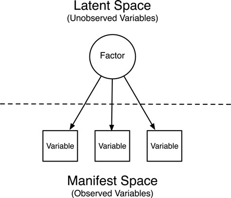
```

---
## Total error: sources of error

```{r echo=FALSE, out.width = '60%', fig.retina = 1, fig.align='center'}
# this is a slide displaying an image only
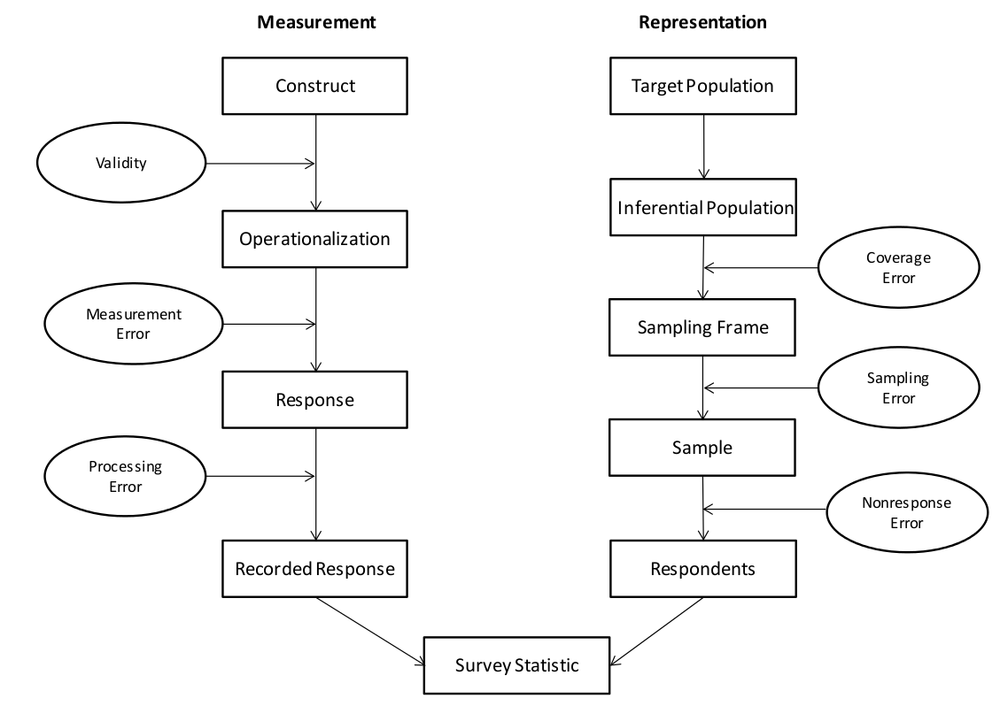
```


---
## Latent variables


- Indirectly observed: hipothetical

- Could be infered from observed indicators (e.g. items)

- Multiple indicators that covariates, could be intepreted as common factor 

---
## Latent variables

- Clasical Test Theory (simplified):

$$X = T + E $$
$$ \sigma^{2}_x = \sigma^{2}_t +  \sigma^{2}_e$$

- Existence of multiple indicators allows to differentiate:

common variance $$\sigma^{2}_t$$ and unique variance $$\sigma^{2}_t$$


---
## Factor Analysis

- Conjunto de métodos para explicar correlaciones entre variables interpretables como variables latentes o factores

- La existencia de un factor común explicaría la asociación entre indicadores

- Dependencia condicional: las correlaciones serían 0 si se parcializa el factor.

---
## Purpose

- Reducir complejidad e incrementar la comprensión

- Validar una escala en términos del constructo que mide

- Separar varianza única de varianza común


---
## General fundaments

- Covarianza, correlación y correlación parcial

- Regresión simple y múltiple

- En general, se pueden considerar los mismos supuestos de regresión líneal

---
## Assumptions 

- Nivel de medición intervalar 

- Normalidad de las mediciones (multivariada)

- Relación líneal entre variables

- Correlaciones deben tener cierto nivel para su agrupación

- Tamaño muestral: >200 casos o entre 5-10 casos por variable

---
## Diagrams of for represent

```{r echo=FALSE, out.width = '60%', fig.retina = 1, fig.align='center'}
# this is a slide displaying an image only
knitr::include_graphics('./files/diagrams.png')
```

---
## ¿Parsimony?

```{r echo=FALSE, out.width = '60%', fig.retina = 1, fig.align='center'}
# this is a slide displaying an image only
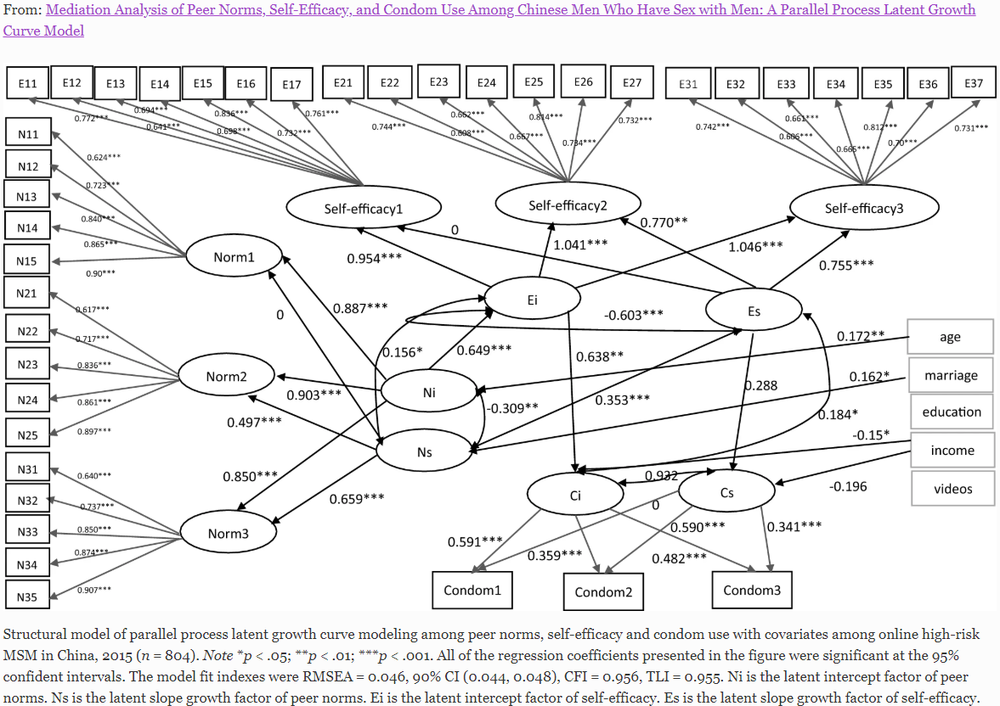
```


---
## Three methods for measurement evaluations

- Principal component analyses: Definición de componente a partir de una combinación líneal de variables

- Exploratory factor analyses: técnica descriptiva que permite determinar un número apropiado de factores latentes a un set de indicadores, separando varianza común de varianza única

- **Confirmatory Factor Analyses**: técnica que permite hipotetizar (y confirmar) una variable latente, especifícando una serie de parámetros 

---
## Three methods for measurement evaluations

```{r echo=FALSE, out.width = '100%', fig.retina = 1, fig.align='center'}
# this is a slide displaying an image only
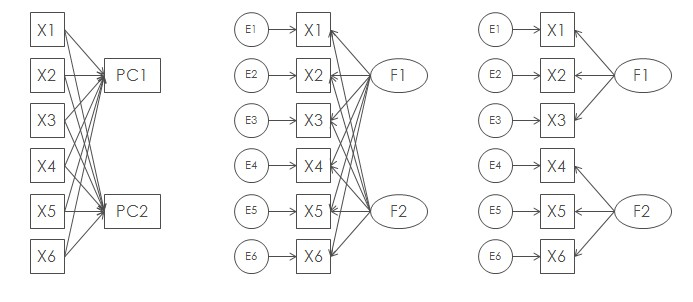
```

---
## Beyond measurement model: SEM

- SEM allow to estimate models that include measurement and structural relations

```{r echo=FALSE, out.width = '60%', fig.retina = 1, fig.align='center'}
# this is a slide displaying an image only
knitr::include_graphics('./files/models1.png')
```

---
## Structural regressions between latent variables

```{r echo=FALSE, out.width = '70%', fig.retina = 1, fig.align='center'}
# this is a slide displaying an image only
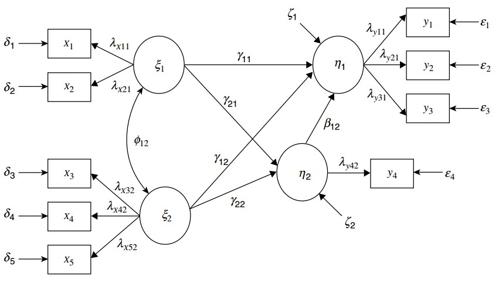
```

---
## Regressions between latent on observed variables (MIMIC)

```{r echo=FALSE, out.width = '40%', fig.retina = 1, fig.align='center'}
# this is a slide displaying an image only
knitr::include_graphics('./files/mimic.jpg')
```

---
## Regressions between observed on latent variables

```{r echo=FALSE, out.width = '60%', fig.retina = 1, fig.align='center'}
# this is a slide displaying an image only
knitr::include_graphics('./files/med_sem.jpg')
```

---
## Regressions between observed variables

```{r echo=FALSE, out.width = '60%', fig.retina = 1, fig.align='center'}
# this is a slide displaying an image only
knitr::include_graphics('./files/jose_33.jpg')
```

---
## Estimation process of CFA and SEM

```{r echo=FALSE, out.width = '50%', fig.retina = 1, fig.align='center'}
# this is a slide displaying an image only
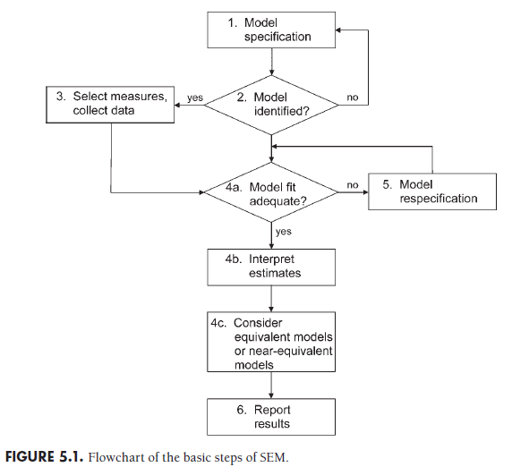
```


---
## Step by step

- Specification and identification
- Estimation
- Fit interpretation
- Report


```{r echo=FALSE, out.width = '40%', fig.retina = 1, fig.align='center'}
# this is a slide displaying an image only

```

---
# Hands on!

.center[]


---
class: center, middle, inverse

# CFA example


```{r echo=FALSE, out.width = '60%', fig.retina = 1, fig.align='center'}
# this is a slide displaying an image only
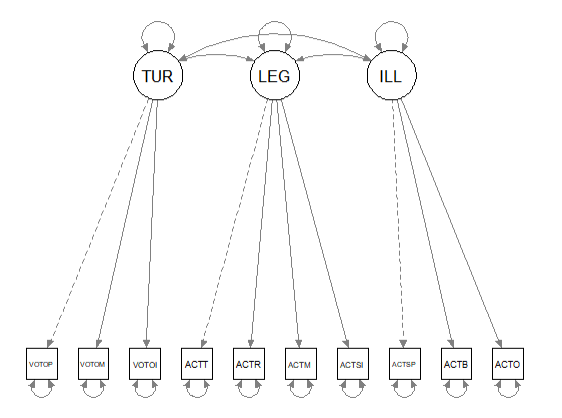
```

---
## Measurement model: Political participation using ICCS 2016 (Italy)


---
## Read data
```{r }
pacman::p_load(dplyr, stargazer, skimr, xaringan, srvyr, lme4, broom, texreg, scales, plotly, desctable, descriptr, forcats, GGally, MplusAutomation, semPlot, corrplot)


load("./data/mergeita16.Rdata")

desc= mergeita16 %>%
  select(actspray, actblock, actocup, acttalk, actrep, actmarch, actsign, votopre, votomun, votoinf)
stargazer(desc,title="Descriptive Statistics", type = "text")

```


---
## Explore correlations
```{r }

corMat  <- cor(desc, use = "pairwise.complete.obs")  # estimar matriz pearson
options(digits=3) # decimales
print(corMat)

```

---
## Explore correlations
```{r }
stargazer(corMat, title="correlaciones", type = "text") #Latex table

```

---
## Explore correlations
```{r , fig.align='center', out.width = '70%', eval=FALSE}

corrplot(corMat, type="lower",
         order="AOE", cl.pos="b", tl.pos="d") #agrega nombres en diag.

```

```{r echo=FALSE, out.width = '40%', fig.retina = 1, fig.align='center'}
# this is a slide displaying an image only
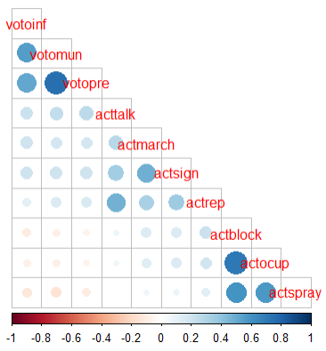
```


---
## Model specification

- Mplus Syntax

```{r , eval=FALSE }

m4 <- mplusObject(
  TITLE = "CFA;",
  VARIABLE=" 
  cluster = idschool_scr;
  Stratification = jkzones;
  Weight = totwgts;",
  ANALYSIS=
    "type = complex;",
  
  MODEL = "
   turnout BY votopre votomun votoinf;
   leg BY acttalk actrep actmarch actsign;
   ill BY actspray actblock actocup;
  "
  ,
  OUTPUT = "CINTERVAL sampstat mod stdyx;",
  rdata = mergeita16)

```


- Generate input and output files

```{r , eval=FALSE }

fit4 <- mplusModeler(m4, modelout = "m4.inp", run = 1L)

```

---
## Model specification
```{r , fig.align='center', out.width = '70%', fig.dim=c(4.8, 4.5), eval=FALSE}

semPaths("./m4.out", intercepts = FALSE, rotation=2)

```

```{r echo=FALSE, out.width = '60%', fig.retina = 1, fig.align='center'}
# this is a slide displaying an image only

```


---
## Model results
```{r, eval=FALSE }
screenreg(fit4, type = 'stdyx', summaries = c("ChiSqM_Value", "ChiSqM_PValue", "CFI", "TLI", "RMSEA_Estimate", "Observations"), digits = 3, single.row=TRUE)

```

```{r echo=FALSE, out.width = '20%', fig.retina = 1, fig.align='center'}
# this is a slide displaying an image only
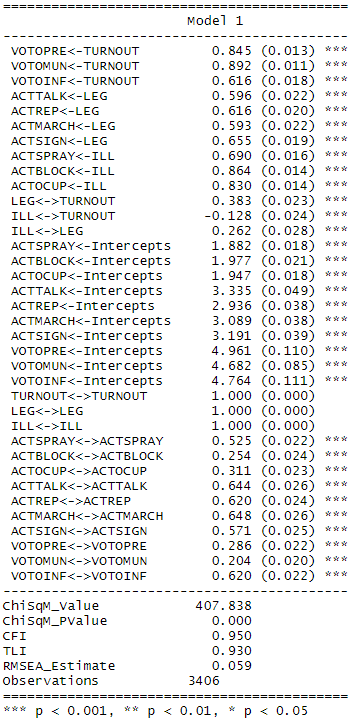
```


---
class: center, middle, inverse

# SEM example
---
## SEM model: Political participation using ICCS 2016 (Italy)

```{r echo=FALSE, out.width = '60%', fig.retina = 1, fig.align='center'}
# this is a slide displaying an image only
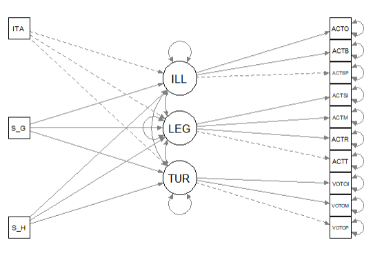
```

---
## Model specification: SEM (Education + Gender + Reading skills)

- Mplus Syntax

```{r , eval=FALSE }
m7 <- mplusObject(
  TITLE = "SEM;",
  VARIABLE=" 
  cluster = idschool_scr;
  Stratification = jkzones;
  Weight = totwgts;",
  ANALYSIS=
    "type = complex;",
  
  MODEL = "
   turnout BY votopre votomun votoinf;
   leg BY acttalk actrep actmarch actsign;
   ill BY actspray actblock actocup;
   
   turnout ON s_hisced s_gender ital ;
   leg ON s_hisced s_gender ital;
   ill ON s_hisced s_gender ital;
   
  "
  ,
  OUTPUT = "CINTERVAL sampstat mod stdyx;",
  rdata = mergeita16)

```


- Generate input and output files

```{r , eval=FALSE }

fit7 <- mplusModeler(m7, modelout = "m7.inp", run = 1L)
```


---
## Model results
```{r, eval=FALSE }
screenreg(fit7, type = 'stdyx', summaries = c("ChiSqM_Value", "ChiSqM_PValue", "CFI", "TLI", "RMSEA_Estimate", "Observations"), digits = 3, single.row=TRUE)

```

```{r echo=FALSE, out.width = '20%', fig.retina = 1, fig.align='center'}
# this is a slide displaying an image only
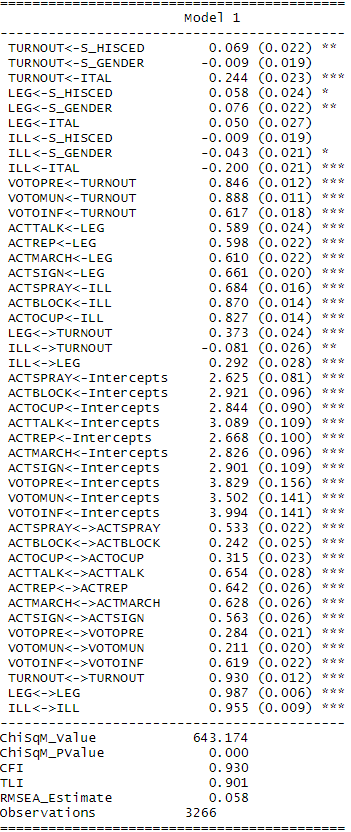
```
---

class: title-slide, middle, center

background-image: url(img/invalsi_left_blue.png), url(img/invalsi_right_blue.png)
background-position: top left, top right
background-size: 10%, 10%

```{r echo=FALSE, out.width = '2%', out.height = '2%'}
# this a goodbye slide
knitr::include_graphics('./img/blank_space.png')
```

<br>

.line_space_07[
## Muchas Gracias!
]
<br>

.line_space_05[
.text_100[Sandoval-Hernández, A., PhD] .text_70[ash22@bath.ac.uk]

.text_100[Carrasco, D., PhD] .text_70[dacarras@uc.cl]

.text_100[Miranda, D., PhD] .text_70[damiran1@uc.l]

.text_100[Inostroza, P., Msc(c)] .text_70[xxxxx@xxx.l]

<br>

.text_70[V Seminar: “INVALSI data: a tool for teaching and scientific research”]

.text_70[ROME,  February 25th – 28th, 2021]

]

<br>

```{r echo=FALSE, out.width = '10%'}

knitr::include_graphics('./img/blank_space.png')

knitr::include_graphics('./img/blank_space.png')

```


